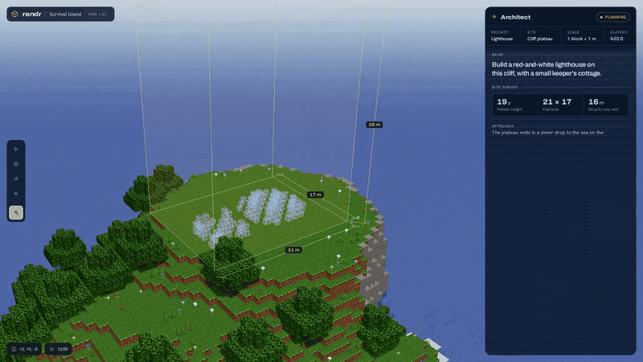
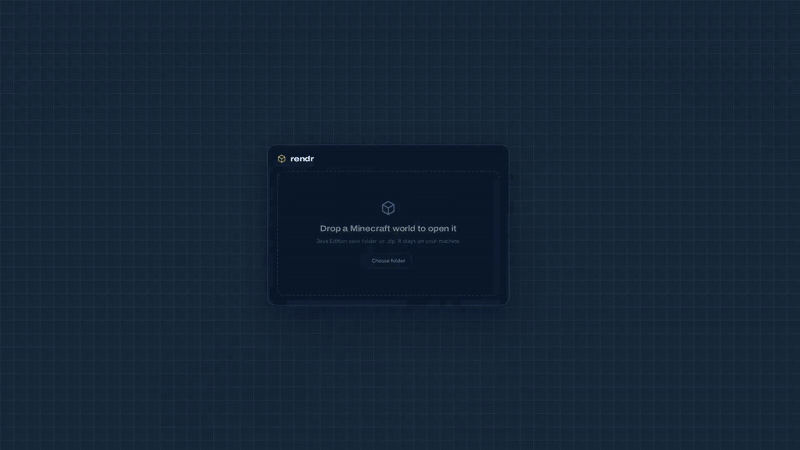
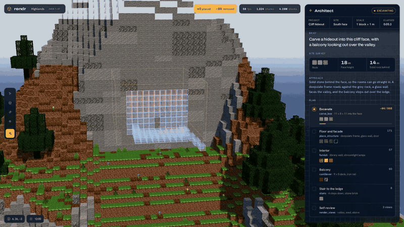

# Rendr

A WebGL Minecraft world viewer and editor, built with React, Three.js and Zustand.

Rendr began in 2024 as a real-time world viewer. In 2026 it was refreshed with
Rendr Studio, an editing UI built around an AI architect flow.

**Project write-up:** [jais.info/projects/rendr-mc](https://www.jais.info/projects/rendr-mc)



## Rendr Studio

`studio.html` holds the Studio UI: WorldEdit-style selection, a build log for
the architect, blueprint previews, and a review step that marks up rendered
viewpoints. Three scenarios show the flow end to end. Each one runs from a
timeline in `src/studio/scenarios/`:

- `?scene=lighthouse`: build a lighthouse and keeper's cottage on a sea cliff
- `?scene=riverside`: open a world file, find an existing base, extend it
- `?scene=mountain`: carve a hideout into a cliff face

| Opening a world | Carving into a cliff |
|---|---|
|  |  |

## Viewer

The original viewer (`index.html`) renders chunks with an isometric RTS-style
camera:

- WASD movement, edge scrolling, drag-to-pan, and a gizmo cube for rotation
- Standard blocks, stairs, slabs, fluids and custom models
- A texture atlas packed at runtime

## Development

```
npm install
npm run dev
```

Then open `/` for the viewer or `/studio.html` for the Studio.

See `documentation.md` for the viewer's architecture, and `docs/landscape.md`
for related open-source projects.
